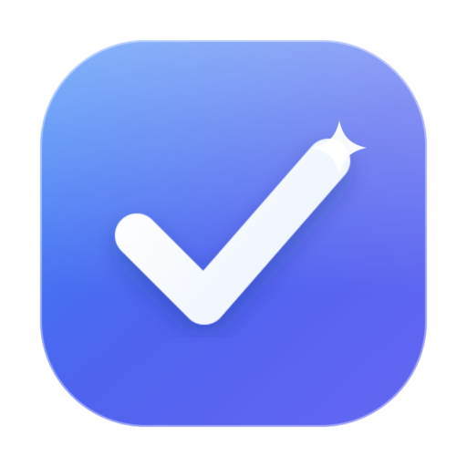
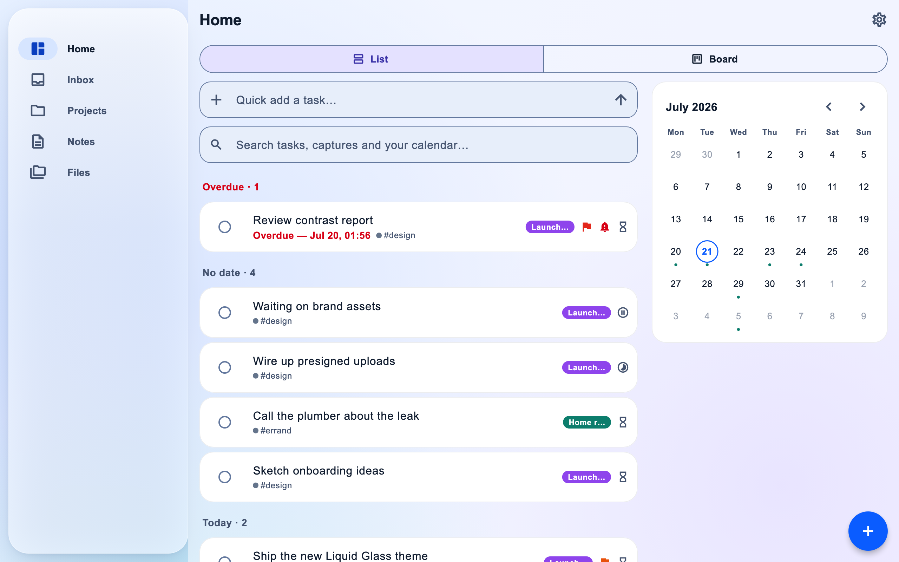
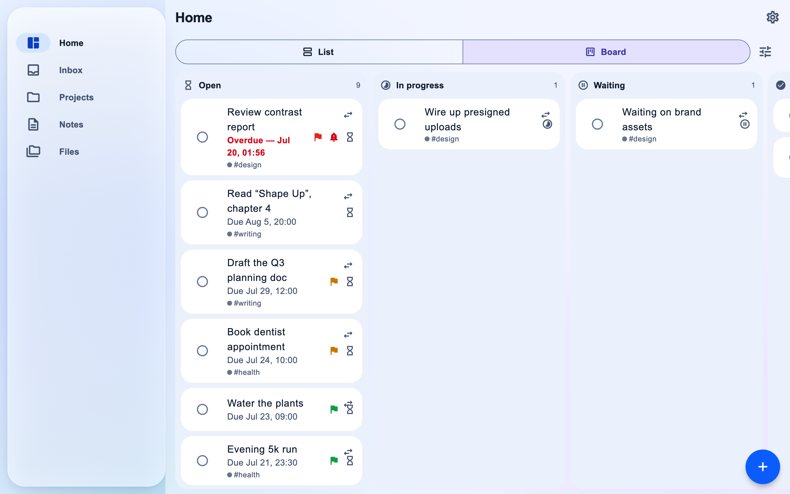
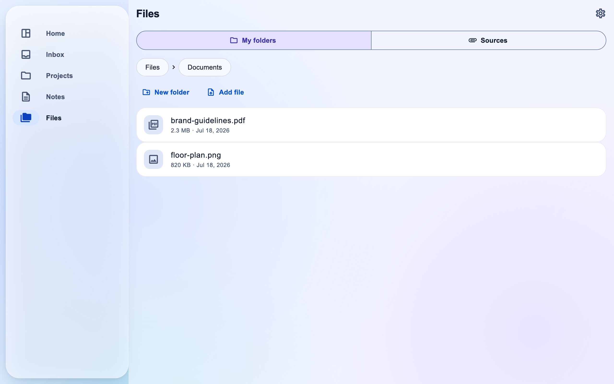
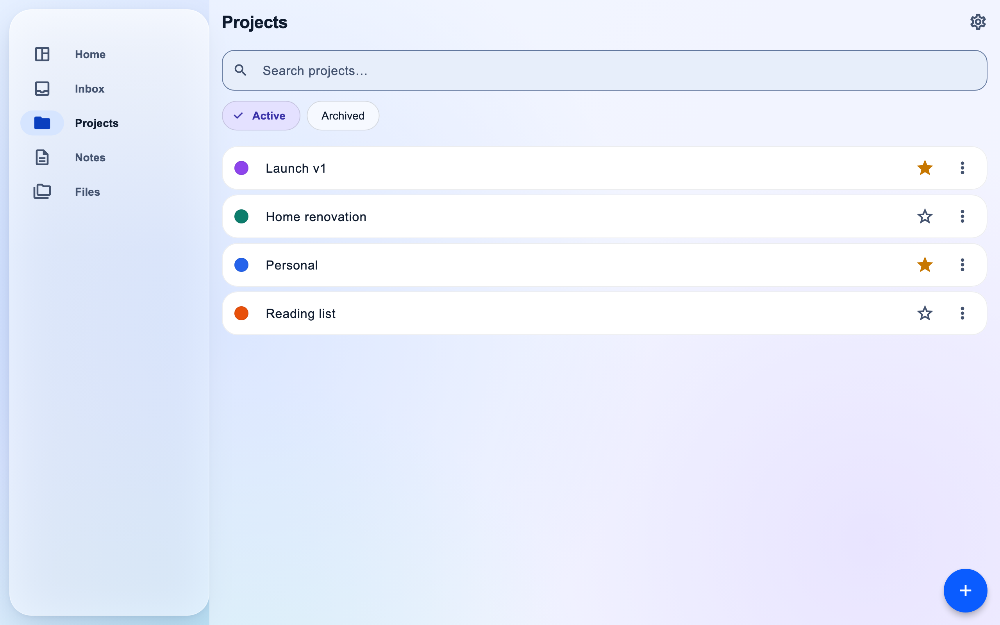
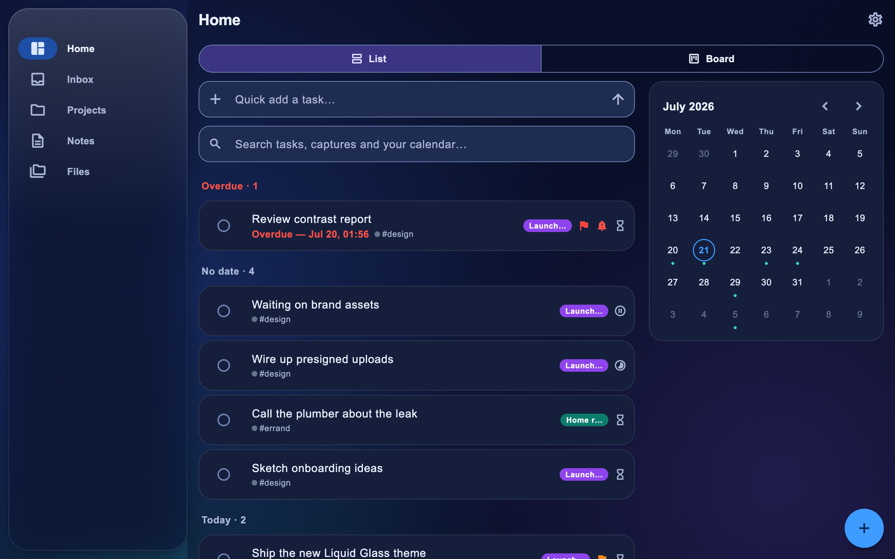
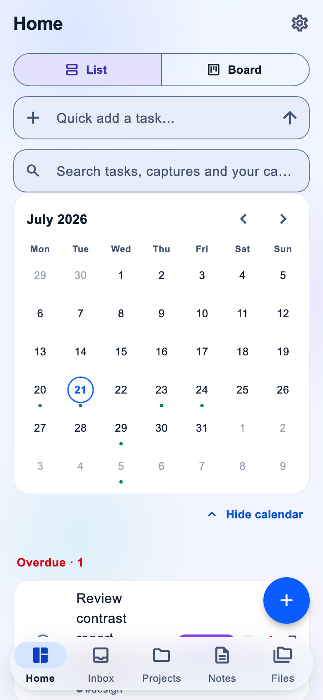
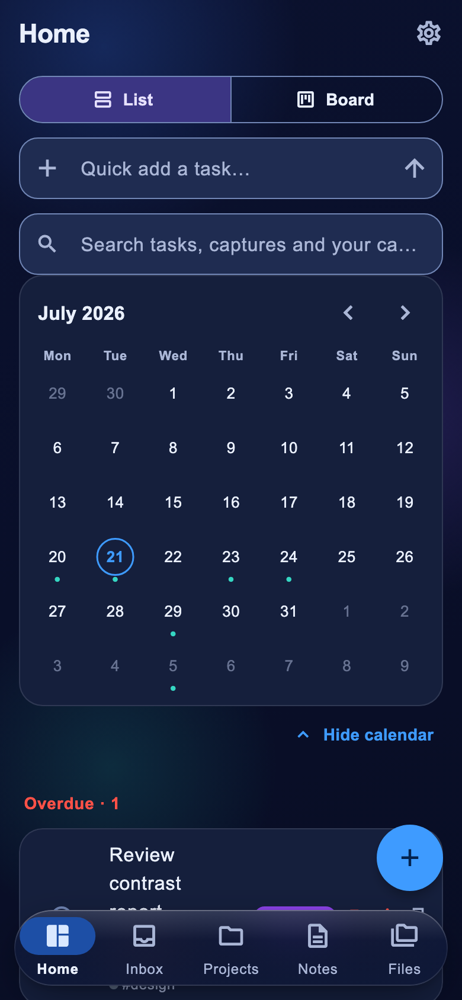
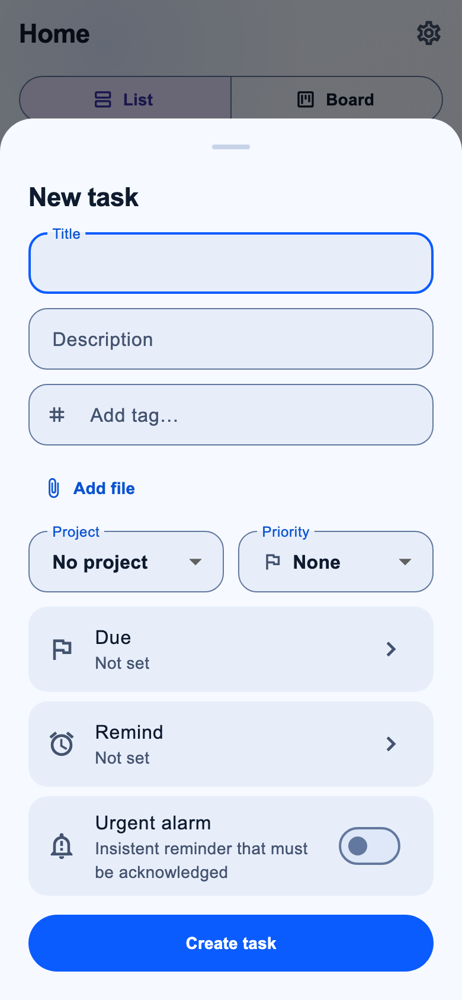

<div align="center">



# AllisWell

**The open-source, self-hosted productivity hub.**

Tasks, projects, notes, files and alarm-grade reminders — with true two-way **Google & Apple Calendar** sync — in one Flutter app for **iOS, Android, Web, macOS, Windows & Linux**. Your data lives in **your own MySQL**, not someone else's cloud.

[](https://github.com/mahirozdin/alliswell/actions/workflows/ci.yml)
[](LICENSE)
[-yellow)](AGENTS.md)
[-02569B)](apps/app)
[](docker-compose.yml)
[](CONTRIBUTING.md)

<em>A free, self-hostable alternative to Todoist, Things 3, TickTick, Apple Reminders & Notion.</em>

</div>

<p align="center">
  <picture>
    <source media="(prefers-color-scheme: dark)" srcset="docs/screenshots/home-dark.png">
    
  </picture>
</p>

**AllisWell** brings your whole day into one place. Capture a task in seconds, plan it on a chronological **Home** or a kanban **Board**, keep rich **notes** and **files**, and never miss what matters thanks to **alarm-grade reminders that ring through Silent mode and Focus**. It works **offline-first** with realtime sync across every device, syncs **two-way with Google Calendar and Apple Calendar**, and is **100% self-hosted** — one `docker compose up` and every byte stays in **your own MySQL database**.

> **Project status.** `v0.1.0` is the current tagged release. The full **`v0.4.0`** feature set described below is already built and tested — **366 app tests + 300+ backend tests green** — and in final on-device QA before its release tag. Track it in [ROADMAP.md](ROADMAP.md) and [docs/STATE.md](docs/STATE.md). ⭐ Star the repo to follow along.

<br>

<details>
<summary><h2>✨ Features — click to expand</h2></summary>

- ⚡ **Fast capture** — add a task in seconds with or without a date; a dedicated **Inbox** keeps unplanned thoughts out of your day until you're ready.
- 🏠 **Home, your way** — one chronological view (overdue · today · this week · next 30 days) with an Apple-style month calendar, **or** flip to a **Board (kanban)** with your own hideable, reorderable status columns and drag-to-move.
- 🗂 **Projects** — colors, favorites, status, archiving, a Notion-style README note, and per-project Tasks / Notes / Files tabs.
- 🏷 **Tags & priorities** — type `#tags` inline (auto-create, colors, fold-matched suggestions) and set `none → urgent` priority.
- 🔔 **Alarm-grade reminders** — exact-time delivery, **urgent alarms that break through Silent mode & Focus**, a re-alert-until-acknowledged chain, snooze presets (5 m / 30 m / 1 h / tomorrow / custom), and a privacy mode that hides task content on the lock screen.
- 🔎 **Instant search** — case- **and Turkish-accent-insensitive** ("cay" finds *Çay*, "isi" finds *ısı*), ranked title → tag → body, running locally over the on-device replica, so it works **offline**.
- 📝 **Notes & documents** — rich-text (Quill Delta) notes with inline images/video, links to tasks & projects, and Markdown export.
- 📅 **True two-way calendar sync** — **Google** (OAuth, encrypted tokens, push webhooks, incremental sync, etag-based conflict resolution) and **Apple Calendar** (EventKit bridge); your own external events flow back into Home.
- 📎 **Attachments & Files** — attach any file to tasks, notes and projects, plus a global **Files** section with nestable folders — stored in **Cloudflare R2 / any S3** via presigned URLs (the API never proxies your bytes).
- 🔄 **Local-first realtime sync** — offline by default: a mutation outbox, a revision log, idempotent push with field-level last-write-wins, and a Socket.IO channel that fans changes to every device within a round-trip.
- 🖥 **Home-screen widgets** — iOS, Android & macOS widgets that mirror your Home buckets (in final device QA).
- 🌐 **Localization** — English + Turkish out of the box, auto-detected; adding a language is dropping in one JSON file.
- 🔓 **Self-hosted & private** — your MySQL, your server, one `docker compose up`. AGPL-3.0.

</details>

<details>
<summary><h2>📸 Screenshots</h2></summary>

<br>

|  |  |
| --- | --- |
| **Board (kanban)** — status columns, drag-to-move | **Files** — folders + every attachment, one place |
|  |  |
| **Projects** — colors, favorites, archive | **Home (dark)** — the same day, dark mode |
|  |  |

<p align="center"><em>On the phone — the same local-first app, from one Flutter codebase:</em></p>

<p align="center">
  
  &nbsp;
  
  &nbsp;
  
</p>

</details>

<details>
<summary><h2>💡 Why AllisWell?</h2></summary>

<br>

The tools we love, we can't fully own. AllisWell combines their best ideas — and adds what none of them give you: **open source, self-hosted, true two-way calendar sync, and a local-first realtime engine.**

| Inspiration | What we take from it |
| --- | --- |
| **Apple Reminders** | Instant capture, date/time alarms, subtasks |
| **Things 3** | Inbox / Today / Upcoming flow, projects & areas |
| **Todoist** | Labels, priorities, filters, cross-platform discipline |
| **TickTick** | Calendar-first planning, kanban board, rich task notes |
| **Notion** | Project document pages, notes as a knowledge base |

> 🇹🇷 Bu proje Türkçe bir ürün vizyonuyla başladı — tam vizyon için [docs/BLUEPRINT.md](docs/BLUEPRINT.md).

</details>

<details>
<summary><h2>🏗 Architecture</h2></summary>

```txt
Flutter App (iOS / Android / macOS / Windows / Linux / Web)
      │  REST + WebSocket (Socket.IO)   ·   offline-first local SQLite replica
      ▼
Node.js API — Fastify, JavaScript only (no TypeScript)
  ├─ Auth (JWT + refresh rotation)     ├─ Sync engine (revision log, outbox)
  ├─ Projects / Tasks / Tags           ├─ Reminder scheduler
  ├─ Notes / Files (presigned R2/S3)   ├─ Calendar sync workers (BullMQ)
  └─ Search (Turkish-fold)             └─ Local search + folders
      │
      ├─ MySQL 8.4  (canonical data)
      ├─ Redis 8    (queues, Socket.IO fan-out, cache)
      ├─ Object storage: Cloudflare R2 / any S3 (attachments)
      └─ Calendar providers: Google Calendar API · Apple EventKit · CalDAV (v2)
```

Details: [docs/ARCHITECTURE.md](docs/ARCHITECTURE.md) • Design decisions: [docs/adr/](docs/adr/)

</details>

<details>
<summary><h2>🚀 Quickstart (development)</h2></summary>

Prerequisites: **Node.js ≥ 22**, **Docker**, **Flutter ≥ 3.44** (for the app).

```bash
git clone https://github.com/mahirozdin/alliswell.git
cd alliswell

# 1. Infra: MySQL + Redis (+ MinIO for attachments)
cp .env.example .env
docker compose up -d mysql redis

# 2. API
npm install
npm run db:migrate
npm run dev              # → http://localhost:3000  (health: /health/ready)

# 3. Flutter app
cd apps/app
flutter pub get
flutter run -d chrome    # or: macos / windows / an emulator
```

Run everything in containers instead: `docker compose --profile full up`.
Optional DB admin UI: `docker compose --profile tools up -d adminer` → http://localhost:8080.

**Optional integrations** (all off until configured, see [.env.example](.env.example)):
Google Calendar (`GOOGLE_*`), and file attachments via Cloudflare R2 / any S3 (`STORAGE_S3_*` — MinIO ships in `docker-compose` for local dev; full guide in [docs/ATTACHMENTS.md](docs/ATTACHMENTS.md)).

### Useful commands

| Command | What it does |
| --- | --- |
| `npm run dev` | Start API with watch mode |
| `npm test` | API unit tests (no infra needed) |
| `npm run test:integration` | API integration tests (needs MySQL+Redis) |
| `npm run lint` / `npm run format` | ESLint / Prettier |
| `npm run db:migrate` / `db:rollback` | Knex migrations |
| `npm run check:no-ts` | Enforce the JavaScript-only policy |
| `npm run check:i18n` | Enforce no hardcoded UI strings (localization) |

</details>

<details>
<summary><h2>📚 Documentation</h2></summary>

| Doc | Purpose |
| --- | --- |
| [docs/BLUEPRINT.md](docs/BLUEPRINT.md) | Product vision, domain model, full functional spec (TR) |
| [docs/ARCHITECTURE.md](docs/ARCHITECTURE.md) | System architecture, stack, sync & calendar design |
| [docs/ATTACHMENTS.md](docs/ATTACHMENTS.md) | File attachments: R2/S3 storage, presigned flow, CORS setup |
| [docs/NOTIFICATIONS.md](docs/NOTIFICATIONS.md) | Exact-time / urgent alarm delivery research & plan |
| [docs/WIDGETS.md](docs/WIDGETS.md) | Home-screen widget architecture |
| [ROADMAP.md](ROADMAP.md) | Phase-by-phase roadmap: shipped, next, and v2 parking lot |
| [docs/TASKS.md](docs/TASKS.md) | Backlog: every OPH-xxx task with acceptance criteria |
| [docs/STATE.md](docs/STATE.md) | Live development state — what's done, what's next |
| [CHANGELOG.md](CHANGELOG.md) | What changed, per release |
| [docs/adr/](docs/adr/) | Architecture Decision Records (0001–0014) |
| [AGENTS.md](AGENTS.md) · [CONTRIBUTING.md](CONTRIBUTING.md) · [SECURITY.md](SECURITY.md) | Workflow, contributing & security policy |

</details>

<details>
<summary><h2>🤖 Built to be developed by AI agents</h2></summary>

This repository is designed for continuous development by AI coding agents:

1. Open [docs/STATE.md](docs/STATE.md) → see the current epic and the **next task**.
2. Say **"do the next task"** (Turkish: *"sıradaki işi yap"*).
3. The agent follows [AGENTS.md](AGENTS.md): implement → test → update docs → check the box in [docs/TASKS.md](docs/TASKS.md) → update STATE → commit.

The markdown files (STATE / TASKS / CHANGELOG) are the single source of truth — no external board required.

</details>

<details>
<summary><h2>🤝 Contributing & License</h2></summary>

Contributions are very welcome — read [CONTRIBUTING.md](CONTRIBUTING.md) and pick a task from [docs/TASKS.md](docs/TASKS.md). Please open an issue before large changes.

**Translations** are especially welcome and need no Dart: copy `apps/app/assets/i18n/en.json` to `<code>.json`, translate the values, and register the locale — see [CONTRIBUTING.md](CONTRIBUTING.md#translating-adding-a-language). Ships with English + Turkish.

**License:** [AGPL-3.0](LICENSE) — free to use, self-host and modify; if you run a modified version as a service, you must share your changes. See [ADR-0002](docs/adr/0002-license-agpl-3.0.md) for why.

</details>

---

<div align="center">
<sub>

**AllisWell** — open-source self-hosted productivity hub · to-do & task manager · Todoist / Things 3 / TickTick / Apple Reminders / Notion alternative · two-way Google Calendar & Apple Calendar sync · offline-first · Flutter (iOS, Android, Web, macOS, Windows, Linux) · Node.js + MySQL · self-hosted & private.

</sub>
</div>
