<div align="center">

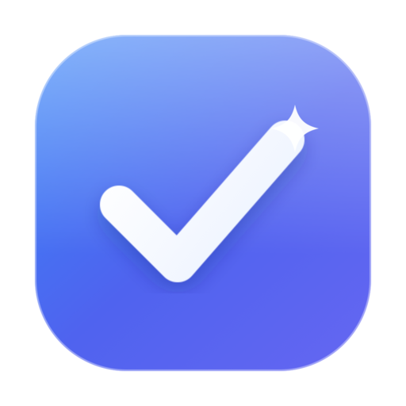

# AllisWell

### Tasks, reminders &amp; notes — in an app you actually own.

**Alarms that ring through Silent mode. Two-way Google &amp; Apple Calendar sync.<br>
One app for iOS, Android, Web, macOS, Windows &amp; Linux. Your data in your own MySQL.**

[**🌐 Try it now — alliswell.space**](https://alliswell.space/app) &nbsp;·&nbsp;
[**🤖 Get it on Google Play**](https://play.google.com/store/apps/details?id=com.alliswell.alliswell) &nbsp;·&nbsp;
[Self-host in one command](#-self-hosting-your-server-your-data) &nbsp;·&nbsp;
[Why it's different](#-why-alliswell-and-where-it-isnt-better)

[](https://github.com/mahirozdin/alliswell/actions/workflows/ci.yml)
[](https://github.com/mahirozdin/alliswell/stargazers)
[](https://play.google.com/store/apps/details?id=com.alliswell.alliswell)
[](LICENSE)
[](#-licence--commercial-use)
[](docker-compose.selfhost.yml)
[-02569B>)](apps/app)
[-yellow>)](AGENTS.md)
[](docs/MCP.md)

<em>A free, self-hostable alternative to Todoist, Things 3, TickTick, Apple Reminders &amp; Notion.</em>

</div>

<p align="center">
  <picture>
    <source media="(prefers-color-scheme: dark)" srcset="screenshots/web/home-dark.png">
    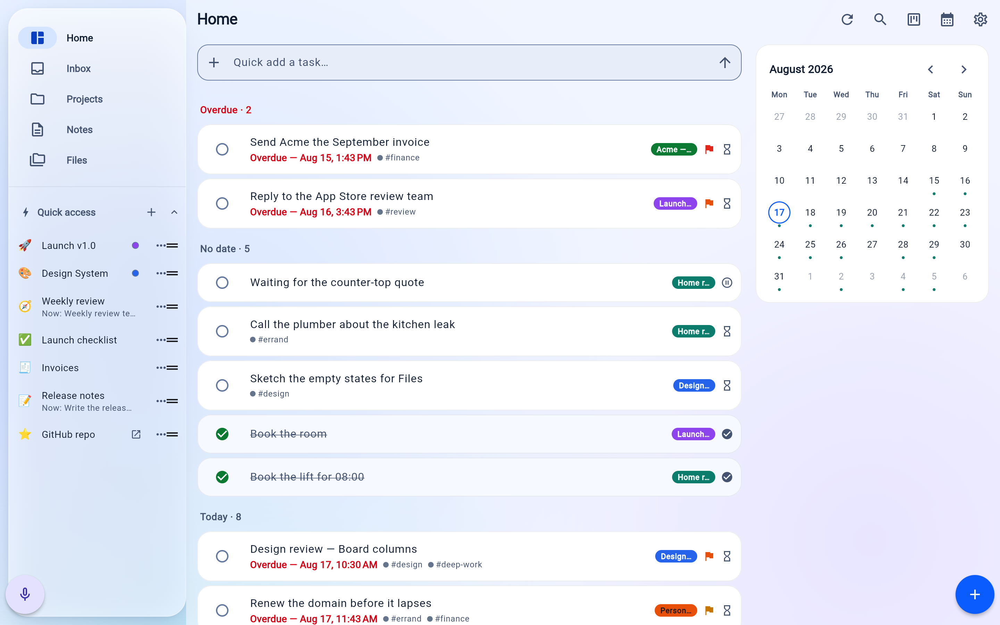
  </picture>
</p>

---

## 🚀 Get it

|                    | Status            |                                                                                                                                     |
| ------------------ | ----------------- | ----------------------------------------------------------------------------------------------------------------------------------- |
| **🌐 Web app**     | **Live now**      | **[alliswell.space/app](https://alliswell.space/app)** — sign up and use it on every device. Nothing to install.                    |
| **🤖 Google Play** | **Live now**      | **[Get it on Google Play](https://play.google.com/store/apps/details?id=com.alliswell.alliswell)** — the Android app, on the store. |
| 🍎 **App Store**   | Internal testing  | TestFlight internal build is running; public release next.                                                                          |
| 🐳 **Self-host**   | Live now          | One `docker compose up` — [guide below](#-self-hosting-your-server-your-data).                                                      |
| 💻 **Desktop**     | Build from source | macOS, Windows and Linux targets build from the same codebase.                                                                      |

> **Project status — `v1.4.0`, live.** Everything on this page is built, tested
> (**1148 app tests · 620 backend unit · 58 integration, green**) and deployed to
> [alliswell.space](https://alliswell.space). Track what's next in
> [ROADMAP.md](ROADMAP.md) and [docs/STATE.md](docs/STATE.md).
> ⭐ Star the repo to follow along.

---

## ⚡ The five things that make it different

Everything else here is table stakes. These five are why people move — and each
one is something the alternatives either cannot do or make you leave the app for.

### 1. Tasks and projects that actually belong together

A task is not a line in a list. It belongs to a **project**, carries its own
description, tags, subtasks, colour and attachments, and shows up wherever that
project does — the project's Overview, its Files tab, its own board column. The
project badge follows the task everywhere, so "what is this for?" never needs a
second click.

### 2. Notes with a real markdown workspace

Not a text box that happens to accept `#`. AllisWell renders **GitHub-flavoured
markdown properly** — tables with their alignment, task lists, footnotes,
callouts, real mathematics, syntax-coloured code with a copy button, and
**Mermaid diagrams drawn as diagrams**, with no browser engine involved.

You get **three ways to look at one document**: Reading, the rich editor, and
the markdown source — with a live preview beside it on a wide screen. Lists
continue themselves, `/table`-style commands work everywhere, ⌘K opens a command
palette, and an outline of every heading follows you as you scroll.

And it is not limited to notes that were born here: **open a `.md` file from
your own computer, edit it, and save it back to that file.** The document is
permanently marked as external, it is never autosaved behind your back, and if
something else changed it while you were editing you are asked what happens to
your version — reload, save a copy, or overwrite. If AllisWell cannot write the
file safely, it says so and does not offer to.

### 3. Alarms, not notifications

A reminder that arrives with a chime is a suggestion. AllisWell's urgent tasks
ring with a **real alarm sound, through Silent mode and through Focus** (iOS 26
AlarmKit; Android's `USAGE_ALARM` insistent channel), keep **re-alerting until
you acknowledge them**, and offer snooze presets that each tell you the exact
time they will ring again. When the OS gets in the way — a battery manager, a
revoked permission — the app writes a log entry explaining itself, so
"it didn't ring" is a question with an answer.

---

### 4. Every file where the work is

The photo of the whiteboard, the contract PDF, the screenshot — they live with
the task or the project they belong to, not in a chat scroll or a downloads
folder. Attach from **Photos, the camera, or Files**; images open in a real
pinch-and-zoom viewer with a swipe between the others; and everything in a
project is listed in its Files tab, in folders you control.

### 5. Recurrence that doesn't lie

Ask for **the 31st** and RFC 5545 — which is what Google Calendar follows —
simply **skips** every month without one. Your rent does not skip February.

| Rule: every month on day 31 | Google Calendar | **AllisWell** |
| --------------------------- | --------------- | ------------- |
| December                    | 31 Dec          | 31 Dec        |
| January                     | 31 Jan          | 31 Jan        |
| **February**                | **— skipped —** | **28 Feb**    |
| March                       | 31 Mar          | 31 Mar        |
| **April**                   | **— skipped —** | **30 Apr**    |

Also: every day / weekday / week / month / year, **the last day of the month**,
**the 2nd Tuesday**, **the first Monday after the 22nd** — with a live
**"next 5" preview** before you commit, twelve rolling months of **real task
rows** (so they show up in search, the calendar and the widget), and an
"edit this / this and future / all" prompt when you change one.

<p align="center">
  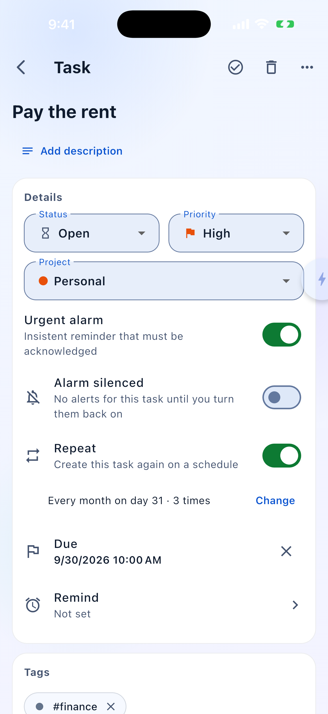
  &nbsp;
  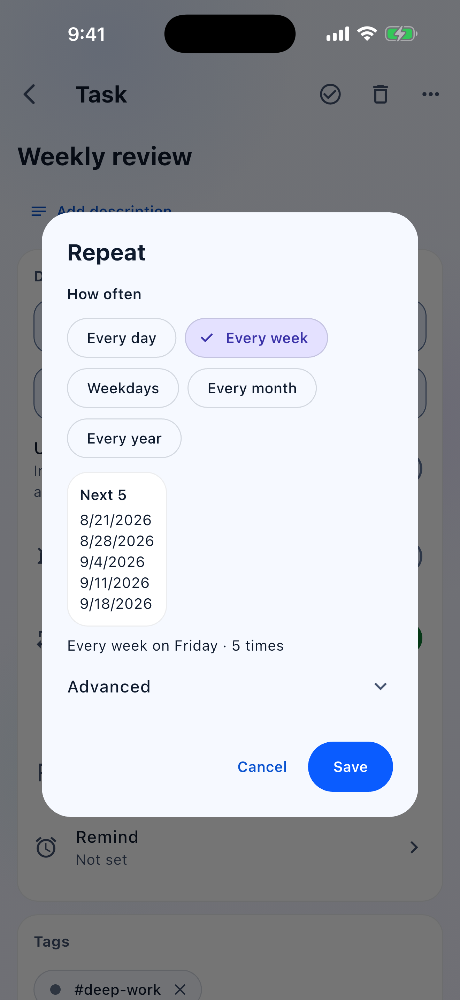
</p>

## 📸 What it looks like

<table>
<tr>
<td width="50%">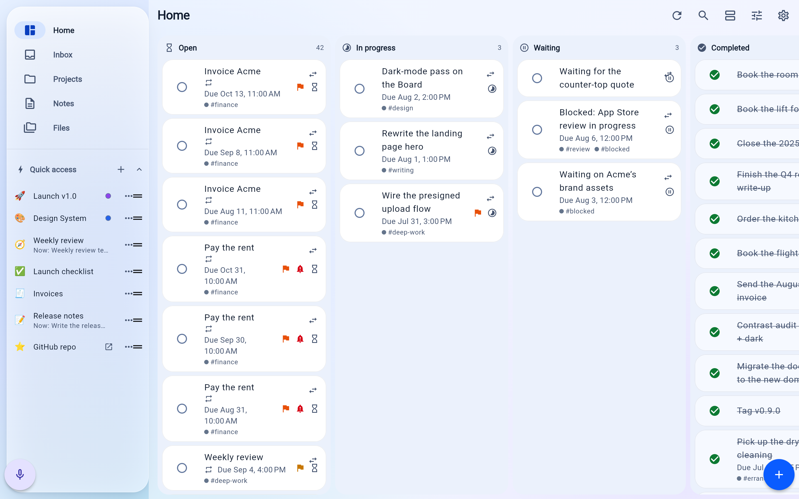</td>
<td width="50%">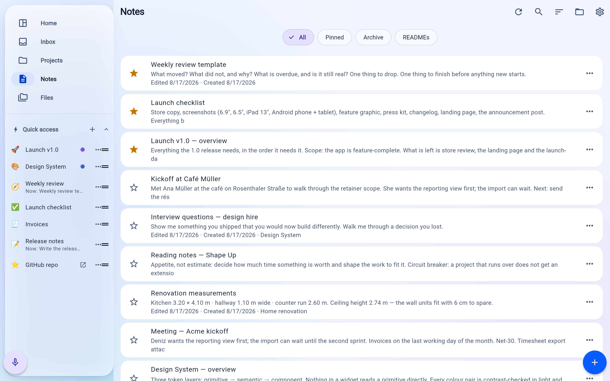</td>
</tr>
<tr>
<td><b>Board</b> — the same day as a kanban, with columns you name, hide and reorder</td>
<td><b>Notes</b> — rich text, pinned, linked to a project, exportable as Markdown</td>
</tr>
<tr>
<td>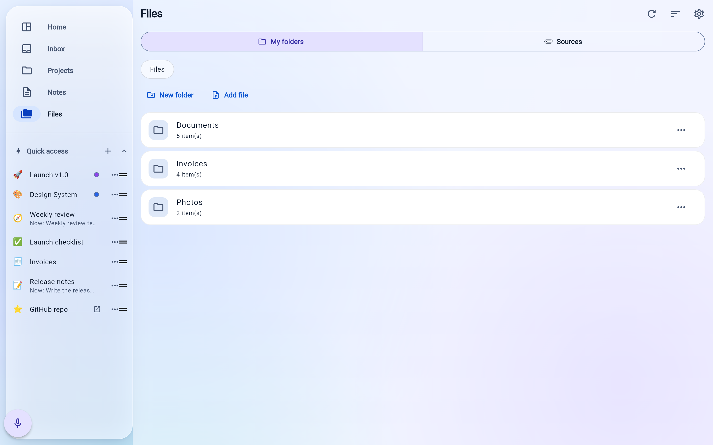</td>
<td>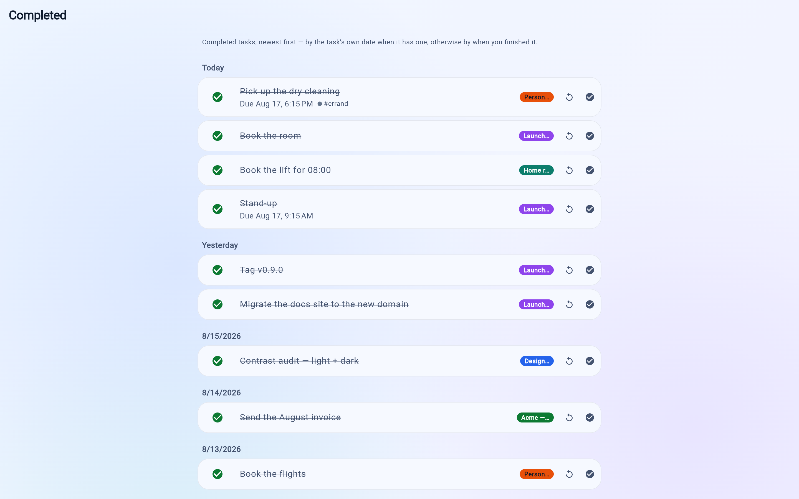</td>
</tr>
<tr>
<td><b>Files</b> — folders + every attachment, in your own R2/S3 bucket</td>
<td><b>Completed</b> — an infinite, day-headed timeline. Nothing vanishes mid-tap</td>
</tr>
</table>

<p align="center"><em>On the phone — the same local-first app, from one Flutter codebase:</em></p>

<p align="center">
  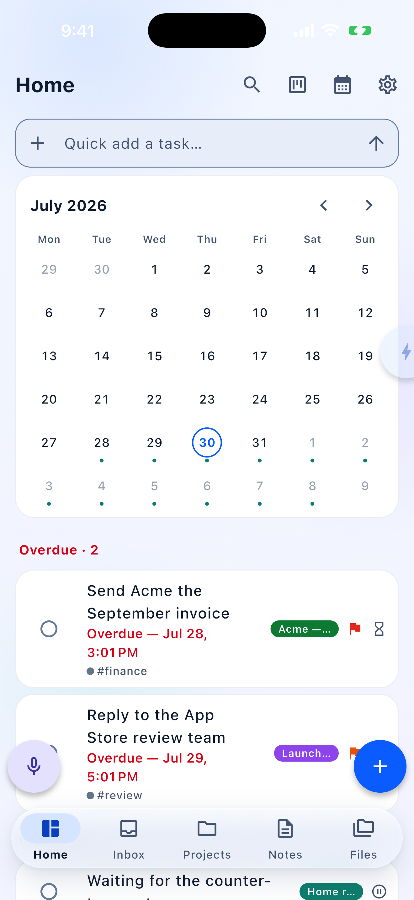
  &nbsp;
  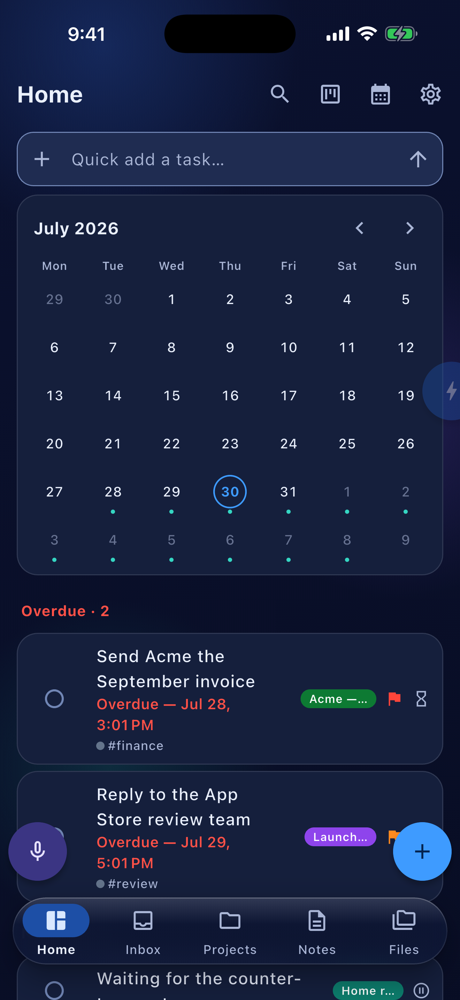
  &nbsp;
  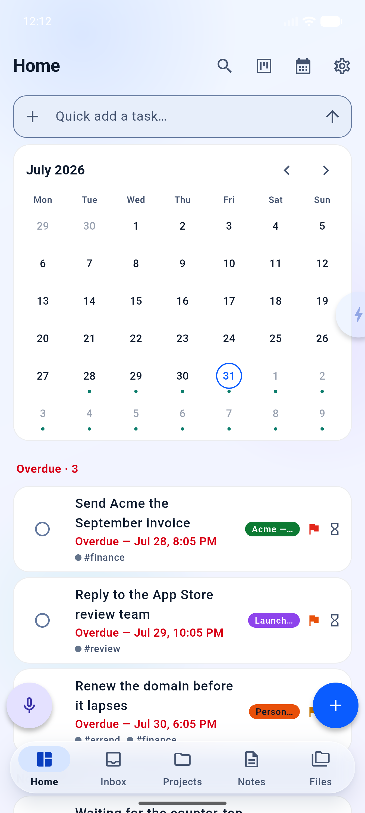
  &nbsp;
  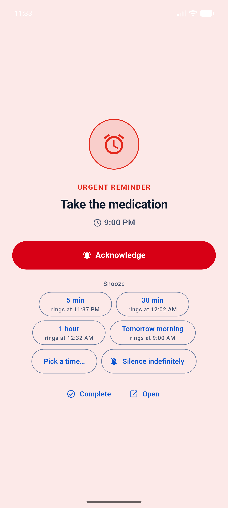
  &nbsp;
  <picture>
    <source media="(prefers-color-scheme: dark)" srcset="screenshots/ios/13-widget-dark.png">
    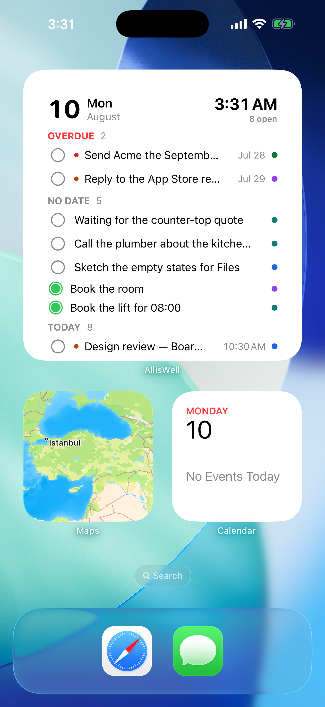
  </picture>
</p>

<p align="center"><sub>iPhone 17 Pro Max · Pixel 9 Pro XL · light, dark, an alarm actually going off, and the Home Screen widget with a clock that really ticks · every one a real capture from a running app, not a mock-up.<br>
How they are produced: <a href="docs/SCREENSHOTS.md">docs/SCREENSHOTS.md</a></sub></p>

---

<details>
<summary><h2>✨ Every feature — click to expand</h2></summary>

- ⚡ **Fast capture** — a task in seconds, with or without a date; a dedicated **Inbox** keeps unplanned thoughts out of your day until you're ready. Plus **press-and-hold to talk**, **share any text or link** into the app, and a **"magic parse"** that turns a sentence into a dated, tagged, projected task.
- 🏠 **Home, your way** — one chronological view (overdue · today · this week · next 30 days) with an Apple-style month calendar, **or** flip to a **Board (kanban)** with your own hideable, reorderable status columns and drag-to-move.
- 🗂 **Projects** — colours, favourites, archiving, a Notion-style README note as the overview, and per-project Tasks / Notes / Files tabs.
- 🏷 **Tags &amp; priorities** — type `#tags` inline (auto-create, colours, fold-matched suggestions) and set `none → urgent` priority. Subtasks and checklists inside a task.
- 🔔 **Alarm-grade reminders** — exact-minute delivery, **urgent alarms through Silent mode &amp; Focus**, a re-alert-until-acknowledged chain you can tune, snooze presets (5 m / 30 m / 1 h / tomorrow / custom) that each say when they'll ring, **mute one task's alarms** without completing it, your own ringtone, an **alarm log**, and a privacy mode that hides task content on the lock screen.
- 🔁 **Recurring tasks that survive a short month** — see [§1 above](#1-recurrence-that-doesnt-lie).
- 🔎 **Instant search** — case- **and accent-insensitive** across the Latin alphabets ("muller" finds _Müller_, "cafe" finds _café_), ranked title → tag → body, running locally over the on-device replica, so it works **offline**. The folding is the app's own, so results never depend on your database's collation.
- 📝 **Notes &amp; documents** — rich-text (Quill Delta) notes with inline images/video, links to tasks and projects, pin/archive, card grid or list, and Markdown export.
- 📅 **True two-way calendar sync** — see [§2 above](#2-true-two-way-calendar-sync-to-both-ecosystems). Every task is on the calendar, and it is **not a setting**.
- 📎 **Attachments &amp; Files** — attach any file to tasks, notes and projects, plus a global **Files** section with nestable folders — stored in **Cloudflare R2 / any S3** via presigned URLs (the API never proxies your bytes).
- 🔄 **Local-first realtime sync** — offline by default: a mutation outbox, a revision log, idempotent push with field-level last-write-wins, and a Socket.IO channel that fans changes to every device within a round-trip.
- ✅ **Finish things visibly** — a completed task stays on today's list, struck through and calm, until the next midnight; everything older lives in **Settings ▸ Completed**, a day-headed timeline you can scroll back through.
- 🗑 **Delete like you expect** — swipe a row from the right, it half-opens, and the red **Delete** is what deletes. Tasks, notes, projects and files, with an **Undo** that works by not having written anything yet.
- ⚡ **Quick access** — a personal shortcut list for the projects, tasks, notes, folders, files and links you actually live in, with your own emoji, colour and order. A **sidebar section** on desktop and web, a popover on narrow windows, and a **draggable floating button** on phones. Yours alone: shortcuts never leak to other members of a shared workspace.
- 🤖 **AI, on your terms (optional)** — see [§4 above](#4-ai-on-your-terms--including-none).
- 🖥 **Home-screen widgets** — iPhone and Android widgets that mirror your Home buckets, carry the **system clock and how many tasks today actually holds** in the header, so the day is readable without unlocking anything.
- 🔑 **Sign in the way you already do** — e-mail and password, **Continue with Google**, or **Continue with Apple**. The provider proves who you are; **AllisWell's own database still owns the account**, so a self-hosted instance works the same way — or drops social sign-in entirely and keeps passwords. [How it works →](docs/adr/0026-social-sign-in.md)
- 🌐 **Localisation** — ships in English and Turkish, auto-detected from your system; adding a language is dropping in one JSON file.
- 🔓 **Self-hosted &amp; private** — your MySQL, your server, one `docker compose up`. Free for personal use ([licence](#-licence--commercial-use)).

</details>

---

## 💡 Why AllisWell — and where it isn't better

The tools we love, we can't fully own. AllisWell takes their best ideas and adds
what none of them give you: **the source in the open, self-hosting you actually
own, true two-way calendar sync, and a local-first realtime engine.**

|                                        | **AllisWell** | Google Calendar | Google Tasks | Apple Reminders | Things 3 |
| -------------------------------------- | :-----------: | :-------------: | :----------: | :-------------: | :------: |
| **Source available**                   |       ●       |        ○        |      ○       |        ○        |    ○     |
| **Self-hosted, your database**         |       ●       |        ○        |      ○       |        ○        |    ○     |
| Price                                  |     free      |      free       |     free     |      free       |   ~$80   |
| iOS · Android · Web · desktop          |       ●       |        ◐        |      ◐       |        ○        |    ○     |
| Works fully offline                    |       ●       |        ◐        |      ◐       |        ●        |    ●     |
| Kanban board                           |       ●       |        ○        |      ○       |        ◐        |    ○     |
| Rich notes &amp; file attachments      |       ●       |        ◐        |      ○       |        ◐        |    ○     |
| **Alarms through Silent + Focus**      |       ●       |        ○        |      ○       |        ◐        |    ○     |
| **Re-alert until acknowledged**        |       ●       |        ○        |      ○       |        ○        |    ○     |
| **Recurrence clamps (31st → 28 Feb)**  |       ●       |        ○        |      ○       |        ●        |    ●     |
| **Two-way Google Calendar sync**       |       ●       |     native      |    native    |        ○        |    ○     |
| **Accent-insensitive search**          |       ●       |        ○        |      ○       |        ○        |    ○     |
| **MCP connector for Claude / ChatGPT** |       ●       |        ○        |      ○       |        ○        |    ○     |

<sub>● full · ◐ partial · ○ none. Competitor behaviour as of mid-2026.</sub>

**Where they beat us — honestly.** Apple Reminders has **location-based** and
**messaging-based** reminders we simply don't have. Google and Apple Calendar do
invitations, RSVPs and free/busy; we mirror to your calendar and let it do that.
Todoist and Apple Reminders have **real collaboration** — assignees, comments,
shared lists — where our workspace model exists but the sharing UI does not.
Things 3 has had ten years to sand its corners; we are at 1.0. And
**self-hosting is work**: a managed app has no `docker compose`, no TLS
certificate and no backups to think about.

**The full analysis** — every claim above, the nine things they do better, and the
lines we deliberately did _not_ write — is in **[docs/COMPARISON.md](docs/COMPARISON.md)**.

---

## 🐳 Self-hosting: your server, your data

Two published images — the API and the web app — for `linux/amd64` and
`linux/arm64`, tagged on every release:

```bash
curl -O https://raw.githubusercontent.com/mahirozdin/alliswell/main/docker-compose.selfhost.yml
curl -o .env https://raw.githubusercontent.com/mahirozdin/alliswell/main/.env.selfhost.example

echo "JWT_ACCESS_SECRET=$(openssl rand -hex 32)"  >> .env
echo "JWT_REFRESH_SECRET=$(openssl rand -hex 32)" >> .env
nano .env   # your domains + database passwords

docker compose -f docker-compose.selfhost.yml up -d
```

The API creates and migrates its own schema on start, so an upgrade is just
`pull` + `up -d` — **your data lives in named volumes and is never touched**.
The web image reads your API address at _container start_, so one prebuilt image
serves any domain without rebuilding Flutter.

Full guide — TLS/reverse proxy, upgrades &amp; backups, Cloudflare R2 attachments,
Google Calendar, troubleshooting: **[docs/SELF-HOSTING.md](docs/SELF-HOSTING.md)**.

---

<details>
<summary><h2>🏗 Architecture</h2></summary>

```txt
Flutter App (iOS / Android / macOS / Windows / Linux / Web)
      │  REST + WebSocket (Socket.IO)   ·   offline-first local SQLite replica
      ▼
Node.js API — Fastify, JavaScript only (no TypeScript)
  ├─ Auth (JWT + refresh rotation)     ├─ Sync engine (revision log, outbox)
  ├─ Projects / Tasks / Tags           ├─ Reminder scheduler
  ├─ Notes / Files (presigned R2/S3)   ├─ Calendar sync workers (BullMQ)
  ├─ Recurrence engine (task_series)   ├─ Remote MCP server (OAuth 2.1)
  └─ Search (accent folding)           └─ AI providers (BYOK, 5 adapters)
      │
      ├─ MySQL 8.4 / MariaDB 10.11+  (canonical data)
      ├─ Redis 8    (queues, Socket.IO fan-out, cache)
      ├─ Object storage: Cloudflare R2 / any S3 (attachments)
      └─ Calendar providers: Google Calendar API · Apple EventKit · CalDAV (v2)
```

The monorepo:

| Path                                             | What it is                                                      |
| ------------------------------------------------ | --------------------------------------------------------------- |
| [`apps/api`](apps/api)                           | Fastify backend — JavaScript only, MySQL via knex               |
| [`apps/app`](apps/app)                           | The Flutter app — all six platforms, one codebase               |
| [`apps/landing`](apps/landing)                   | This site — Vue 3 + Vite, served at the root of alliswell.space |
| [`scripts/seed-demo.mjs`](scripts/seed-demo.mjs) | The demo workspace every screenshot is shot from                |
| [`scripts/screenshots/`](scripts/screenshots)    | Screenshot + store-asset pipeline                               |

Details: [docs/ARCHITECTURE.md](docs/ARCHITECTURE.md) • Design decisions: [docs/adr/](docs/adr/)

</details>

<details>
<summary><h2>🚀 Quickstart (development)</h2></summary>

Prerequisites: **Node.js ≥ 22**, **Docker**, **Flutter ≥ 3.44** (for the app).

```bash
git clone https://github.com/mahirozdin/alliswell.git
cd alliswell

# 1. Infra: MySQL + Redis (+ MinIO for attachments)
cp .env.example .env
docker compose up -d mysql redis

# 2. API
npm install
npm run db:migrate
npm run dev              # → http://localhost:3000  (health: /health/ready)

# 3. Flutter app
cd apps/app
flutter pub get
flutter run -d chrome    # or: macos / windows / an emulator
```

Want the app full of realistic data in one command?

```bash
npm run seed:demo        # demo@alliswell.space / AllisWellDemo2026
```

Run everything in containers instead: `docker compose --profile full up`.
Optional DB admin UI: `docker compose --profile tools up -d adminer` → http://localhost:8080.

**Optional integrations** (all off until configured, see [.env.example](.env.example)):
Google Calendar (`GOOGLE_*`), file attachments via Cloudflare R2 / any S3 (`STORAGE_S3_*`),
and AI (`AI_*` — off by default; see [docs/AI.md](docs/AI.md)).

### Useful commands

| Command                              | What it does                                    |
| ------------------------------------ | ----------------------------------------------- |
| `npm run dev`                        | Start API with watch mode                       |
| `npm test`                           | API unit tests (no infra needed)                |
| `npm run test:integration`           | API integration tests (needs MySQL+Redis)       |
| `npm run seed:demo`                  | Fill a running instance with the demo workspace |
| `npm run shots:web`                  | Regenerate the web screenshots                  |
| `npm run landing:dev`                | Run the marketing site locally                  |
| `npm run lint` / `npm run format`    | ESLint / Prettier                               |
| `npm run db:migrate` / `db:rollback` | Knex migrations                                 |
| `npm run check:no-ts`                | Enforce the JavaScript-only policy              |
| `npm run check:i18n`                 | Enforce no hardcoded UI strings (localisation)  |

</details>

<details>
<summary><h2>📚 Documentation</h2></summary>

| Doc                                                                                      | Purpose                                                                                   |
| ---------------------------------------------------------------------------------------- | ----------------------------------------------------------------------------------------- |
| [docs/COMPARISON.md](docs/COMPARISON.md)                                                 | Full feature inventory + honest comparison with Google, Apple and Things 3                |
| [docs/BLUEPRINT.md](docs/BLUEPRINT.md)                                                   | Product vision, domain model, full functional spec (TR)                                   |
| [docs/ARCHITECTURE.md](docs/ARCHITECTURE.md)                                             | System architecture, stack, sync &amp; calendar design                                    |
| [docs/SELF-HOSTING.md](docs/SELF-HOSTING.md)                                             | Run your own instance with Docker: TLS, upgrades, backups, storage                        |
| [docs/AI.md](docs/AI.md) · [docs/MCP.md](docs/MCP.md)                                    | AI providers &amp; consent · the remote MCP connector                                     |
| [docs/FIREBASE.md](docs/FIREBASE.md)                                                     | Analytics, Crashlytics, Performance — optional, and how to point them at **your** project |
| [docs/ATTACHMENTS.md](docs/ATTACHMENTS.md)                                               | File attachments: R2/S3 storage, presigned flow, CORS setup                               |
| [docs/MARKDOWN.md](docs/MARKDOWN.md)                                                     | The markdown workspace: field survey, feature scope, document model                       |
| [docs/NOTIFICATIONS.md](docs/NOTIFICATIONS.md)                                           | Exact-time / urgent alarm delivery research &amp; plan                                    |
| [docs/WIDGETS.md](docs/WIDGETS.md)                                                       | Home-screen widget architecture                                                           |
| [docs/SCREENSHOTS.md](docs/SCREENSHOTS.md)                                               | How every image in this repo is produced                                                  |
| [docs/STORE-LISTING.md](docs/STORE-LISTING.md)                                           | App Store &amp; Play copy, asset sizes, claim guardrails                                  |
| [ROADMAP.md](ROADMAP.md)                                                                 | Phase-by-phase roadmap: shipped, next, and v2 parking lot                                 |
| [docs/TASKS.md](docs/TASKS.md) · [docs/STATE.md](docs/STATE.md)                          | Every OPH-xxx task · live development state                                               |
| [CHANGELOG.md](CHANGELOG.md)                                                             | What changed, per release                                                                 |
| [docs/adr/](docs/adr/)                                                                   | Architecture Decision Records (0001–0026)                                                 |
| [AGENTS.md](AGENTS.md) · [CONTRIBUTING.md](CONTRIBUTING.md) · [SECURITY.md](SECURITY.md) | Workflow, contributing &amp; security policy                                              |

</details>

<details>
<summary><h2>🤖 Built to be developed by AI agents</h2></summary>

This repository is designed for continuous development by AI coding agents:

1. Open [docs/STATE.md](docs/STATE.md) → see the current epic and the **next task**.
2. Say **"do the next task"** (Turkish: _"sıradaki işi yap"_).
3. The agent follows [AGENTS.md](AGENTS.md): implement → test → update docs → check the box in [docs/TASKS.md](docs/TASKS.md) → update STATE → commit.

The markdown files (STATE / TASKS / CHANGELOG) are the single source of truth — no external board required.

</details>

---

## ⚖️ Licence & commercial use

**AllisWell is free for you, and not free for your employer.** That is the whole
rule; everything below is detail.

The source is public and it always will be. You can read it, fork it, change it,
and run your own instance on your own machine forever without paying anyone or
asking anyone. What you cannot do is take it into a business — resell it, offer
it as a service, or run it as part of a commercial operation.

| You are…                                                                      |             Free?             |
| ----------------------------------------------------------------------------- | :---------------------------: |
| A person, using it for your own life                                          |            ✅ Free            |
| Self-hosting your own instance at home or on your own VPS                     |            ✅ Free            |
| Studying it, forking it, submitting a fix, building on it as a hobby          |            ✅ Free            |
| A charity, school, university, public research body or government institution |            ✅ Free            |
| A company running it for your team, at any size                               | ❌ Needs a commercial licence |
| Reselling it, or offering it to others as a hosted service                    | ❌ Needs a commercial licence |

**Enterprise, or anything commercial → [info@bubiapps.com](mailto:info@bubiapps.com).**
Commercial licences exist, they are not expensive, and they come with the
self-hosting support the free tier does not.

**Why this and not AGPL.** AllisWell used to be AGPL-3.0, and AGPL would have let
a competitor host the whole product commercially and comply merely by publishing
their changes. This is a single-maintainer product whose revenue is the hosted
service at [alliswell.space](https://alliswell.space) and the app stores — so the
licence now protects exactly that, and nothing else. The full reasoning, the
alternatives that were weighed (FSL, Elastic License, AGPL + commercial
exception), and the consequences are in
**[ADR-0024](docs/adr/0024-license-polyform-noncommercial.md)**.

**Being straight about the label.** PolyForm Noncommercial is **source-available**,
not OSI "open source" — it discriminates against commercial use, which the Open
Source Definition forbids. The repo used to say "open source" everywhere; it now
says source-available, because the other word would be untrue.

**If you already have v0.9.0 or earlier**, you have it under AGPL-3.0 and you
keep those rights for that copy. A licence granted cannot be taken back. These
terms apply from **v1.0.0**.

---

## 🤝 Contributing &amp; licence

Contributions are very welcome — read [CONTRIBUTING.md](CONTRIBUTING.md) and pick
a task from [docs/TASKS.md](docs/TASKS.md). Please open an issue before large changes.

**Translations** are especially welcome and need no Dart: copy
`apps/app/assets/i18n/en.json` to `<code>.json`, translate the values, and
register the locale — see [CONTRIBUTING.md](CONTRIBUTING.md#translating-adding-a-language).

**Licence:** [PolyForm Noncommercial 1.0.0](LICENSE) — see
[Licence & commercial use](#-licence--commercial-use) above. Contributions are
accepted under the same terms.

---

<div align="center">

**[⭐ Star this repo](https://github.com/mahirozdin/alliswell)** &nbsp;·&nbsp;
**[🌐 alliswell.space](https://alliswell.space)** &nbsp;·&nbsp;
**[Open the app](https://alliswell.space/app)** &nbsp;·&nbsp;
**[🤖 Google Play](https://play.google.com/store/apps/details?id=com.alliswell.alliswell)**

<sub>

**AllisWell** — source-available self-hosted productivity hub · to-do &amp; task manager · Todoist / Things 3 / TickTick / Apple Reminders / Notion alternative · two-way Google Calendar &amp; Apple Calendar sync · offline-first · Flutter (iOS, Android, Web, macOS, Windows, Linux) · Node.js + MySQL · self-hosted &amp; private.

</sub>
</div>
