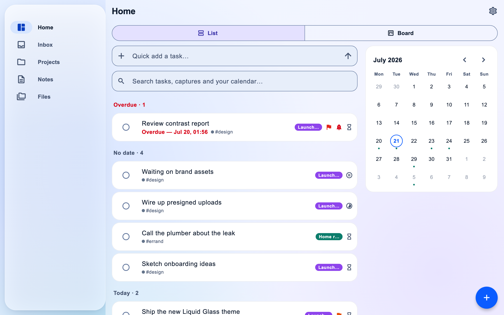
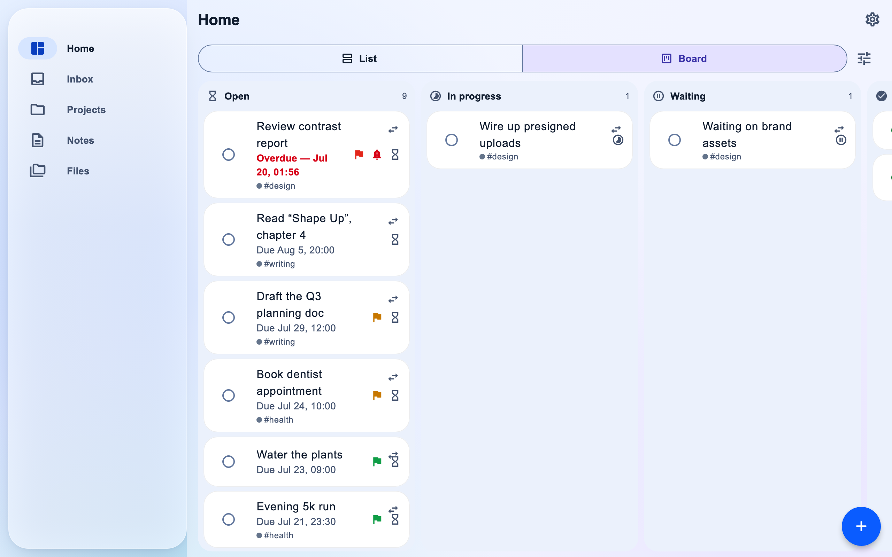
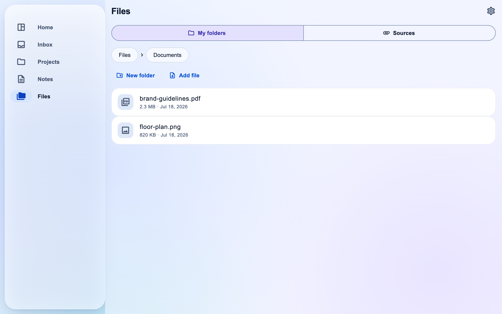
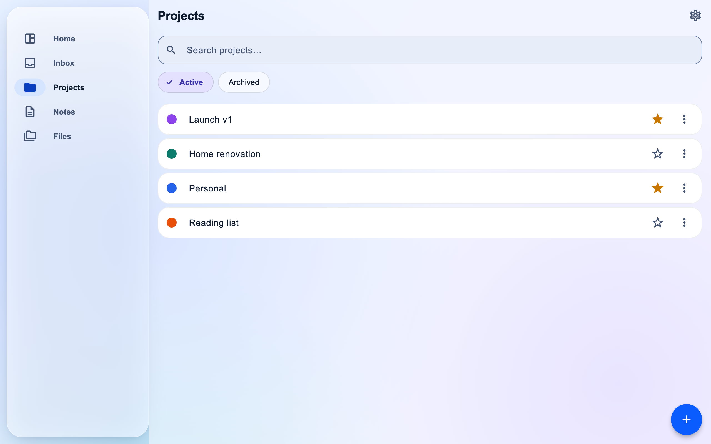
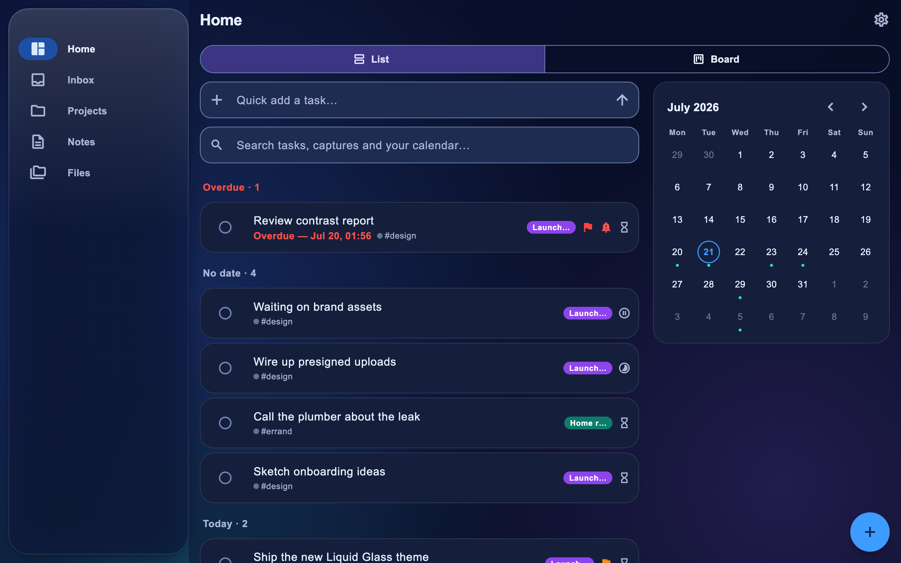
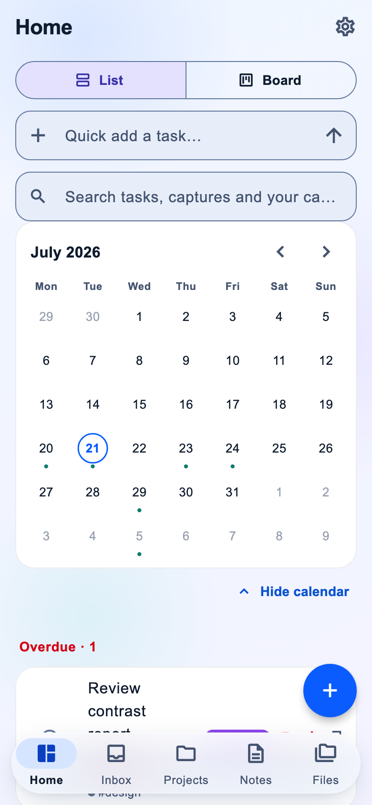
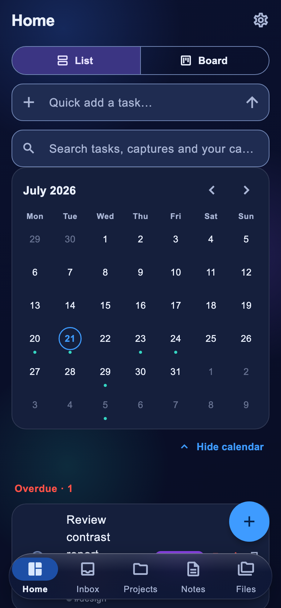
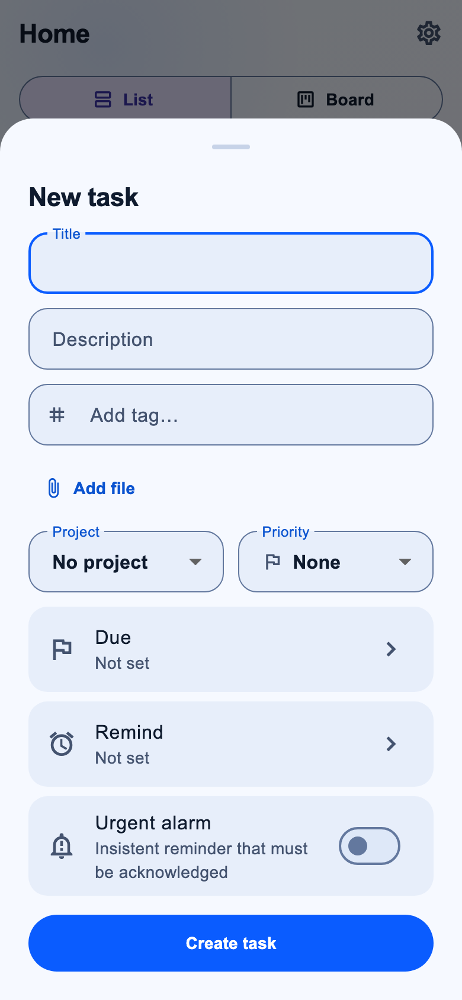

<div align="center">


# AllisWell

**The open-source, self-hosted productivity hub.**

Tasks, projects, notes, files and alarm-grade reminders — with true two-way **Google & Apple Calendar** sync — in one Flutter app for **iOS, Android, Web, macOS, Windows & Linux**. Your data lives in **your own MySQL**, not someone else's cloud.

[](https://github.com/mahirozdin/alliswell/actions/workflows/ci.yml)
[](LICENSE)
[-yellow>)](AGENTS.md)
[-02569B>)](apps/app)
[](docker-compose.yml)
[](CONTRIBUTING.md)

[](docs/MCP.md)
[](docs/AI.md)

<em>A free, self-hostable alternative to Todoist, Things 3, TickTick, Apple Reminders & Notion.</em>

</div>

<p align="center">
  <picture>
    <source media="(prefers-color-scheme: dark)" srcset="docs/screenshots/home-dark.png">
    
  </picture>
</p>

**AllisWell** brings your whole day into one place. Capture a task in seconds, plan it on a chronological **Home** or a kanban **Board**, keep rich **notes** and **files**, and never miss what matters thanks to **alarm-grade reminders that ring through Silent mode and Focus**. It works **offline-first** with realtime sync across every device, syncs **two-way with Google Calendar and Apple Calendar**, and is **100% self-hosted** — one `docker compose up` and every byte stays in **your own MySQL database**.

> **Project status.** Everything described below through **`v0.9.0`** — the AI epic (a chat bubble, press-to-talk and share capture, bring-your-own-key providers, and an MCP connector for Claude & ChatGPT), plus recurring tasks, the always-on calendar mirror, Quick Access and alarm-grade reminders — is built and tested (**748 app tests + 592 backend unit + 58 integration green**) and in final on-device QA before its release tag. Track it in [ROADMAP.md](ROADMAP.md) and [docs/STATE.md](docs/STATE.md). ⭐ Star the repo to follow along.

<br>

<details>
<summary><h2>✨ Features — click to expand</h2></summary>

- ⚡ **Fast capture** — add a task in seconds with or without a date; a dedicated **Inbox** keeps unplanned thoughts out of your day until you're ready.
- 🏠 **Home, your way** — one chronological view (overdue · today · this week · next 30 days) with an Apple-style month calendar, **or** flip to a **Board (kanban)** with your own hideable, reorderable status columns and drag-to-move.
- 🗂 **Projects** — colors, favorites, archiving, a Notion-style README note, and per-project Tasks / Notes / Files tabs.
- 🏷 **Tags & priorities** — type `#tags` inline (auto-create, colors, fold-matched suggestions) and set `none → urgent` priority.
- 🔔 **Alarm-grade reminders** — exact-time delivery, **urgent alarms that break through Silent mode & Focus**, a re-alert-until-acknowledged chain, snooze presets (5 m / 30 m / 1 h / tomorrow / custom), and a privacy mode that hides task content on the lock screen.
- 🔎 **Instant search** — case- **and Turkish-accent-insensitive** ("cay" finds _Çay_, "isi" finds _ısı_), ranked title → tag → body, running locally over the on-device replica, so it works **offline**.
- 📝 **Notes & documents** — rich-text (Quill Delta) notes with inline images/video, links to tasks & projects, and Markdown export.
- 📅 **True two-way calendar sync** — **Google** (OAuth, encrypted tokens, push webhooks, incremental sync, etag-based conflict resolution) and **Apple Calendar** (EventKit bridge); your own external events flow back into Home.
- 📎 **Attachments & Files** — attach any file to tasks, notes and projects, plus a global **Files** section with nestable folders — stored in **Cloudflare R2 / any S3** via presigned URLs (the API never proxies your bytes).
- 🔄 **Local-first realtime sync** — offline by default: a mutation outbox, a revision log, idempotent push with field-level last-write-wins, and a Socket.IO channel that fans changes to every device within a round-trip.
- ✅ **Finish things visibly** — a completed task stays on today's list, struck through and calm, until the next midnight; everything older lives in **Settings ▸ Completed**, a day-headed timeline you can scroll back through. Nothing vanishes mid-tap.
- 🗑 **Delete like you expect** — swipe a row from the right, it half-opens, and the red **Delete** is what deletes. Tasks, notes, projects and files, with an **Undo** that works by not having written anything yet.
- ⚡ **Quick access** — a personal shortcut list for the projects, tasks, notes, folders, files and links you actually live in, with your own emoji, color and order. It is a **section of the sidebar** on desktop and web, a popover on narrow windows, and a **draggable floating button** on phones (park it anywhere; it fades out of your way when idle). Yours alone: shortcuts never leak to other members of a shared workspace.
- 🔁 **Recurring tasks that survive a short month** — repeat a task **every day / week / month / year**, on **weekdays**, on the **last day of the month**, on the **2nd Tuesday**, or on **the first Monday after the 22nd**. Pick "the 31st" and February gets the 28th — AllisWell **clamps, never skips** (Google Calendar would drop that month entirely). A live **"next 5"** preview shows exactly which days you are about to get, the next **12 months** are real tasks you can see in the calendar and the widget, and editing one occurrence asks how far the change should reach — this one, this and future, or all of them.
- 🤖 **AI, on your terms (optional)** — chat with your tasks in a bubble, **press-to-talk** a task into being, or **share** any text or link straight into AllisWell. **Bring your own key** — Anthropic, OpenAI, Gemini, OpenRouter, or a local **Ollama** — with no AllisWell account and no markup. Every task it proposes waits for **your one-tap confirmation**, the model is given **no tools of its own**, and capture still works with **zero AI**. On-device speech means your **voice never leaves the device** — only the text does. [How AI works →](docs/AI.md)
- 🔌 **Connect it to Claude or ChatGPT** — AllisWell is also a **remote MCP server**: link it to the Claude or ChatGPT subscription you already pay for and ask them about your tasks, through read-first tools with **no delete, ever**, behind your own OAuth. [Set it up →](docs/MCP.md)
- 🖥 **Home-screen widgets** — iOS, Android & macOS widgets that mirror your Home buckets, show **how many tasks today actually holds**, and (iOS 17+/Android) let you tick one off **without opening the app** (device QA pending).
- 🌐 **Localization** — English + Turkish out of the box, auto-detected; adding a language is dropping in one JSON file.
- 🔓 **Self-hosted & private** — your MySQL, your server, one `docker compose up`. AGPL-3.0.

</details>

<details>
<summary><h2>📸 Screenshots</h2></summary>

<br>

|                                                                                                                  |                                                                                                                            |
| ---------------------------------------------------------------------------------------------------------------- | -------------------------------------------------------------------------------------------------------------------------- |
| **Board (kanban)** — status columns, drag-to-move                                                                | **Files** — folders + every attachment, one place                                                                          |
|  |  |
| **Projects** — colors, favorites, archive                                                                        | **Home (dark)** — the same day, dark mode                                                                                  |
|            |                                                    |

<p align="center"><em>On the phone — the same local-first app, from one Flutter codebase:</em></p>

<p align="center">
  
  &nbsp;
  
  &nbsp;
  
</p>

</details>

<details>
<summary><h2>💡 Why AllisWell?</h2></summary>

<br>

The tools we love, we can't fully own. AllisWell combines their best ideas — and adds what none of them give you: **open source, self-hosted, true two-way calendar sync, and a local-first realtime engine.**

| Inspiration         | What we take from it                                   |
| ------------------- | ------------------------------------------------------ |
| **Apple Reminders** | Instant capture, date/time alarms, subtasks            |
| **Things 3**        | Inbox / Today / Upcoming flow, projects & areas        |
| **Todoist**         | Labels, priorities, filters, cross-platform discipline |
| **TickTick**        | Calendar-first planning, kanban board, rich task notes |
| **Notion**          | Project document pages, notes as a knowledge base      |

> 🇹🇷 Bu proje Türkçe bir ürün vizyonuyla başladı — tam vizyon için [docs/BLUEPRINT.md](docs/BLUEPRINT.md).

</details>

<details>
<summary><h2>🏗 Architecture</h2></summary>

```txt
Flutter App (iOS / Android / macOS / Windows / Linux / Web)
      │  REST + WebSocket (Socket.IO)   ·   offline-first local SQLite replica
      ▼
Node.js API — Fastify, JavaScript only (no TypeScript)
  ├─ Auth (JWT + refresh rotation)     ├─ Sync engine (revision log, outbox)
  ├─ Projects / Tasks / Tags           ├─ Reminder scheduler
  ├─ Notes / Files (presigned R2/S3)   ├─ Calendar sync workers (BullMQ)
  └─ Search (Turkish-fold)             └─ Local search + folders
      │
      ├─ MySQL 8.4 / MariaDB 10.11+  (canonical data)
      ├─ Redis 8    (queues, Socket.IO fan-out, cache)
      ├─ Object storage: Cloudflare R2 / any S3 (attachments)
      └─ Calendar providers: Google Calendar API · Apple EventKit · CalDAV (v2)
```

Details: [docs/ARCHITECTURE.md](docs/ARCHITECTURE.md) • Design decisions: [docs/adr/](docs/adr/)

</details>

<details>
<summary><h2>🐳 Self-hosting (Docker)</h2></summary>

Two published images — the API and the web app — for `linux/amd64` and
`linux/arm64`, tagged on every release:

```bash
curl -O https://raw.githubusercontent.com/mahirozdin/alliswell/main/docker-compose.selfhost.yml
curl -o .env https://raw.githubusercontent.com/mahirozdin/alliswell/main/.env.selfhost.example

echo "JWT_ACCESS_SECRET=$(openssl rand -hex 32)"  >> .env
echo "JWT_REFRESH_SECRET=$(openssl rand -hex 32)" >> .env
nano .env   # your domains + database passwords

docker compose -f docker-compose.selfhost.yml up -d
```

The API creates and migrates its own schema on start, so an upgrade is just
`pull` + `up -d` — **your data lives in named volumes and is never touched**.
The web image reads your API address at _container start_, so one prebuilt
image serves any domain without rebuilding Flutter.

Full guide — TLS/reverse proxy, upgrades & backups, Cloudflare R2 attachments,
Google Calendar, troubleshooting: **[docs/SELF-HOSTING.md](docs/SELF-HOSTING.md)**.

</details>

<details>
<summary><h2>🚀 Quickstart (development)</h2></summary>

Prerequisites: **Node.js ≥ 22**, **Docker**, **Flutter ≥ 3.44** (for the app).

```bash
git clone https://github.com/mahirozdin/alliswell.git
cd alliswell

# 1. Infra: MySQL + Redis (+ MinIO for attachments)
cp .env.example .env
docker compose up -d mysql redis

# 2. API
npm install
npm run db:migrate
npm run dev              # → http://localhost:3000  (health: /health/ready)

# 3. Flutter app
cd apps/app
flutter pub get
flutter run -d chrome    # or: macos / windows / an emulator
```

Run everything in containers instead: `docker compose --profile full up`.
Optional DB admin UI: `docker compose --profile tools up -d adminer` → http://localhost:8080.

**Optional integrations** (all off until configured, see [.env.example](.env.example)):
Google Calendar (`GOOGLE_*`), and file attachments via Cloudflare R2 / any S3 (`STORAGE_S3_*` — MinIO ships in `docker-compose` for local dev; full guide in [docs/ATTACHMENTS.md](docs/ATTACHMENTS.md)).

### Useful commands

| Command                              | What it does                                   |
| ------------------------------------ | ---------------------------------------------- |
| `npm run dev`                        | Start API with watch mode                      |
| `npm test`                           | API unit tests (no infra needed)               |
| `npm run test:integration`           | API integration tests (needs MySQL+Redis)      |
| `npm run lint` / `npm run format`    | ESLint / Prettier                              |
| `npm run db:migrate` / `db:rollback` | Knex migrations                                |
| `npm run check:no-ts`                | Enforce the JavaScript-only policy             |
| `npm run check:i18n`                 | Enforce no hardcoded UI strings (localization) |

</details>

<details>
<summary><h2>📚 Documentation</h2></summary>

| Doc                                                                                      | Purpose                                                            |
| ---------------------------------------------------------------------------------------- | ------------------------------------------------------------------ |
| [docs/BLUEPRINT.md](docs/BLUEPRINT.md)                                                   | Product vision, domain model, full functional spec (TR)            |
| [docs/ARCHITECTURE.md](docs/ARCHITECTURE.md)                                             | System architecture, stack, sync & calendar design                 |
| [docs/SELF-HOSTING.md](docs/SELF-HOSTING.md)                                             | Run your own instance with Docker: TLS, upgrades, backups, storage |
| [docs/ATTACHMENTS.md](docs/ATTACHMENTS.md)                                               | File attachments: R2/S3 storage, presigned flow, CORS setup        |
| [docs/NOTIFICATIONS.md](docs/NOTIFICATIONS.md)                                           | Exact-time / urgent alarm delivery research & plan                 |
| [docs/WIDGETS.md](docs/WIDGETS.md)                                                       | Home-screen widget architecture                                    |
| [ROADMAP.md](ROADMAP.md)                                                                 | Phase-by-phase roadmap: shipped, next, and v2 parking lot          |
| [docs/TASKS.md](docs/TASKS.md)                                                           | Backlog: every OPH-xxx task with acceptance criteria               |
| [docs/STATE.md](docs/STATE.md)                                                           | Live development state — what's done, what's next                  |
| [CHANGELOG.md](CHANGELOG.md)                                                             | What changed, per release                                          |
| [docs/adr/](docs/adr/)                                                                   | Architecture Decision Records (0001–0014)                          |
| [AGENTS.md](AGENTS.md) · [CONTRIBUTING.md](CONTRIBUTING.md) · [SECURITY.md](SECURITY.md) | Workflow, contributing & security policy                           |

</details>

<details>
<summary><h2>🤖 Built to be developed by AI agents</h2></summary>

This repository is designed for continuous development by AI coding agents:

1. Open [docs/STATE.md](docs/STATE.md) → see the current epic and the **next task**.
2. Say **"do the next task"** (Turkish: _"sıradaki işi yap"_).
3. The agent follows [AGENTS.md](AGENTS.md): implement → test → update docs → check the box in [docs/TASKS.md](docs/TASKS.md) → update STATE → commit.

The markdown files (STATE / TASKS / CHANGELOG) are the single source of truth — no external board required.

</details>

<details>
<summary><h2>🤝 Contributing & License</h2></summary>

Contributions are very welcome — read [CONTRIBUTING.md](CONTRIBUTING.md) and pick a task from [docs/TASKS.md](docs/TASKS.md). Please open an issue before large changes.

**Translations** are especially welcome and need no Dart: copy `apps/app/assets/i18n/en.json` to `<code>.json`, translate the values, and register the locale — see [CONTRIBUTING.md](CONTRIBUTING.md#translating-adding-a-language). Ships with English + Turkish.

**License:** [AGPL-3.0](LICENSE) — free to use, self-host and modify; if you run a modified version as a service, you must share your changes. See [ADR-0002](docs/adr/0002-license-agpl-3.0.md) for why.

</details>

---

<div align="center">
<sub>

**AllisWell** — open-source self-hosted productivity hub · to-do & task manager · Todoist / Things 3 / TickTick / Apple Reminders / Notion alternative · two-way Google Calendar & Apple Calendar sync · offline-first · Flutter (iOS, Android, Web, macOS, Windows, Linux) · Node.js + MySQL · self-hosted & private.

</sub>
</div>
