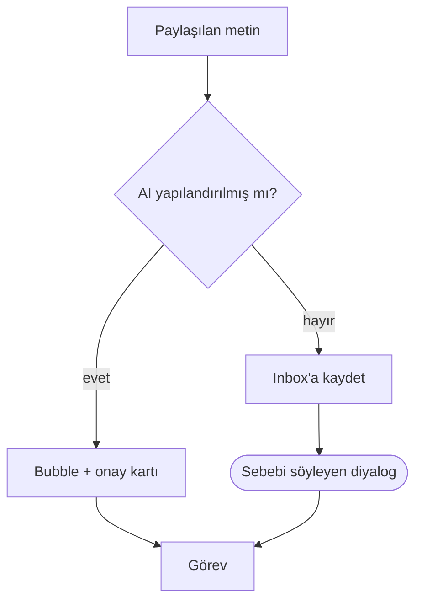
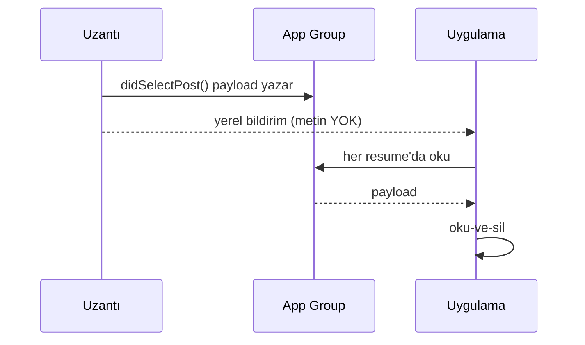
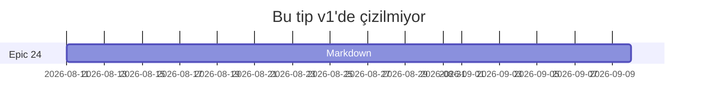

# Markdown uygunluk fikstürü

Bu belge **tek bir amaç** için var: DESIGN §29 D6'nın — *"GitHub render
ediyorsa AllisWell de eder"* — ölçülebilir hali olmak.

İki işi birden yapar:

1. **OPH-246'nın hakemi.** Aday render motorları bu belgeye karşı puanlanır:
   kaç bölüm doğru çizildi, kaçı `AwTokens`'tan tema aldı.
2. **OPH-247'nin regresyon ağı.** Her bölüm için bir **yapısal** assert yazılır
   (golden değil — hangi widget doğdu).

> [!IMPORTANT]
> Bu dosya, güvenlik yüzeyini sınamak için **bilerek** zararlı görünen girdiler
> taşır: bir `javascript:` bağlantısı, canlı olmaması gereken bir HTML bloğu ve
> çözülemeyen bir görsel. Bunlar birer **test vakasıdır**, saldırı değil —
> D10'un "belge güvenilmez girdidir" kuralının kanıtı buradan çıkar.

Bölümler sabit başlıklardır; testler onları çapalarıyla hedefler.

---

## Satır içi biçimlendirme

Düz metin, **kalın**, *italik*, ***kalın italik***, ~~üstü çizili~~,
`satır içi kod`, ==vurgulanmış metin== ve bir kaçış: \*yıldız değil\*.

Emoji kısa kodu: :rocket: :warning: :white_check_mark:

Autolink (işaretlemesiz, düz URL): https://alliswell.space

Açık bağlantı: [AllisWell](https://alliswell.space "başlık metni")

Satır sonunda iki boşlukla kırılan bir satır  
ve onun devamı.

Alt bilgi çağrısı: markdown bir belge biçimidir[^1] ve GFM onun lehçesidir[^gfm].

---

## Başlıklar ve çapalar

### Üçüncü seviye

#### Dördüncü seviye

##### Beşinci seviye

###### Altıncı seviye

---

## Türkçe başlık

Bu bölüm **D16 + ADR-0013**'ün kesişimini sınar. GitHub'ın slug kuralı
"küçült, boşlukları tireye çevir, noktalamayı at" der — ama `İ`/`ı`
katlamasını **ne SQLite ne MySQL** doğru yapar (DUCET ayrı ağırlık verir), yani
çapa üretimi `core/fold.dart` ile app-owned olmak zorundadır.

Aşağıdaki üç bağlantının **üçü de** hedefine gitmelidir:

- [Türkçe başlığa git](#türkçe-başlık)
- [Satır içi biçimlendirmeye dön](#satır-içi-biçimlendirme)
- [Tablolara git](#tablolar)

---

## Listeler

### Sırasız, üç seviye iç içe

- Birinci seviye
  - İkinci seviye
    - Üçüncü seviye
    - Üçüncü seviye, ikinci madde
  - İkinci seviyeye dönüş
- Birinci seviyeye dönüş

### Sıralı ve yeniden numaralanan

1. Birinci
2. İkinci
   1. İç içe birinci
   2. İç içe ikinci
3. Üçüncü

### Kaynakta yanlış numaralanmış (render 1-2-3 olmalı)

1. Bir
1. İki
1. Üç

### Görev listesi (D4 — okuma modunda tıklanabilir, belgeye yazar)

- [ ] Yapılmamış madde
- [x] Yapılmış madde
- [ ] İç içe görev listesi
  - [x] Alt madde tamam
  - [ ] Alt madde açık

### Tanım benzeri gevşek liste

- **Terim** — açıklaması aynı satırda.

- **İkinci terim** — arada boş satır olduğu için bu liste *gevşektir* ve
  maddeler paragraf olarak sarılır.

---

## Tablolar

### Hizalamalı

| Sol       | Ortalı    | Sağ |
| :-------- | :-------: | --: |
| `md`      | metin     |   1 |
| `delta`   | JSON      |  42 |
| **kalın** | ~~çizik~~ | 100 |

### Geniş — D8'in kanıtı (kendi kutusunda yatay kaydırmalı, sayfa kaymamalı)

| Alan | Tür | Boş geçilir | Varsayılan | Açıklama | Kaynak | Sürüm | Not |
| ---- | --- | ----------- | ---------- | -------- | ------ | ----- | --- |
| `id` | `char(26)` | hayır | — | ULID birincil anahtar | `ids.js` | v1 | Crockford |
| `content_delta` | `json` | evet | `null` | Quill Delta belgesi | OPH-013 | v1 | kanonik olabilir |
| `content_markdown` | `mediumtext` | evet | `null` | markdown gövdesi | OPH-013 | v1 | kanonik olabilir |
| `content_format` | `varchar` | hayır | `'delta'` | hangisi kanonik | OPH-248 | v1.4 | ADR-0028 |
| `revision` | `bigint` | hayır | `0` | senkron sayacı | OPH-050 | v1 | `withRevision` |

---

## Alıntılar ve uyarı kutuları

> Sade bir alıntı.
>
> > İç içe alıntı.

> [!NOTE]
> Okurun bilmesi faydalı olan bilgi.

> [!TIP]
> İşleri kolaylaştıran bir öneri.

> [!IMPORTANT]
> Hedefe ulaşmak için kritik olan bilgi.

> [!WARNING]
> Dikkat gerektiren, acil olabilecek içerik.

> [!CAUTION]
> Bir eylemin olası olumsuz sonuçları.

---

## Kod blokları

Dil etiketli — D9 gereği etiket **ve** kopyala butonu görünmeli:

```dart
/// Fikstürün bu bloğu sözdizimi vurgulamasını sınar.
String slugify(String heading) =>
    foldSearchText(heading).replaceAll(RegExp(r'[^a-z0-9]+'), '-');
```

```js
// Backend JavaScript'tir — TypeScript yasak (AGENTS §1.1).
export async function up(knex) {
  await knex.schema.alterTable('notes', (t) => {
    t.string('content_format', 16).notNullable().defaultTo('delta');
  });
}
```

Dilsiz çit:

```
düz metin çiti — vurgulama yok, ama kutu ve kopyala butonu yine olmalı
```

Çok uzun satırlı blok (D8: kendi kutusunda kaymalı):

```sql
SELECT n.id, n.title, n.content_format, n.revision, n.updated_at FROM notes n JOIN workspaces w ON w.id = n.workspace_id WHERE n.deleted_at IS NULL AND w.id = ? ORDER BY n.updated_at DESC LIMIT 50;
```

Girintiyle yazılmış kod bloğu:

    bu da bir kod bloğudur (dört boşluk)

---

## Matematik

Satır içi: $E = mc^2$ ve $\sum_{i=1}^{n} i = \frac{n(n+1)}{2}$.

Blok:

$$
\int_{0}^{\infty} e^{-x^2}\,dx = \frac{\sqrt{\pi}}{2}
$$

$$
\begin{aligned}
f(x) &= (x+1)^2 \\
     &= x^2 + 2x + 1
\end{aligned}
$$

---

## Diyagramlar

### Flowchart — OPH-254'te gerçekten çizilir



### Sequence — OPH-254'te gerçekten çizilir



### Desteklenmeyen tip — D11 dürüst yer tutucusuna düşmeli



### Bozuk mermaid — yine D11, ama sebebi "ayrıştırılamadı" olmalı

```mermaid
flowchart TD
    A[Kapanmamış köşeli parantez --> B
    B -->
```

---

## Görseller

Göreli yollu görsel — bu fikstüre göre **gerçekten vardır**
(`apps/app/test/fixtures/` → depo kökü dört seviye). Göreli yol çözümü yalnız
OPH-251'in dış-dosya yolunda anlamlıdır: bir notun gömüleri
`alliswell://file/{id}`'dir, diskten açılan bir `.md`'nin görselleri ise kendi
klasörüne görelidir. Çözemeyen motor bunu **kırık görselden ayırt edebilmeli**.


Kırık görsel — D11: boşluk değil, dürüst yer tutucu:


Bağlantıya sarılmış görsel:

[](https://alliswell.space)

---

## Güvenlik vakaları (D10)

Bunların **hiçbiri** canlı olmamalıdır.

`javascript:` şemalı bağlantı — inert metin olmalı, tıklanabilir değil:

[Bana tıkla](javascript:alert('xss'))

`data:` şemalı bağlantı — aynı kural:

[Veri URI'si](data:text/html;base64,PHNjcmlwdD5hbGVydCgxKTwvc2NyaXB0Pg==)

HTML bloğu — kaçırılmış **kaynak** olarak çizilmeli, asla canlı DOM olarak:

<div style="background:red">
  <script>alert('bu asla çalışmamalı')</script>
  
  <a href="javascript:void(0)">ne de bu</a>
</div>

Satır içi HTML:

Bu cümlede <b>kalın olmamalı</b> ve <script>alert(1)</script> görünür kaynak olmalı.

Uzak görsel — not gömülerinin kurallarına uymalı:


---

## Yatay çizgi ve son

Üç ayrı yazım, üçü de aynı şeyi çizmeli:

---

***

___

## Dipnotlar

[^1]: Dipnot gövdesi. Dokunuşla aşağı iner, geri dönülebilir.
[^gfm]: GitHub Flavored Markdown — tablo, görev listesi, dipnot, üstü çizili,
    autolink, uyarı kutuları, mermaid çitleri ve `$…$` matematiği kapsar.
